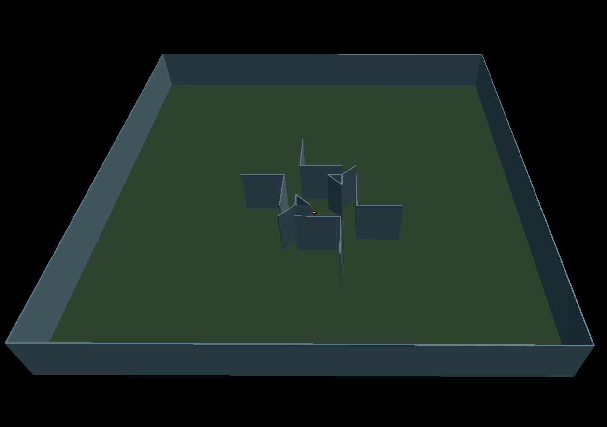

# Labyrinthian 
#### “Knowledge comes at a price of skill, no information is given to the unworthy” ####
----

### [Early Gameplay video! (from the most recent development build)](https://drive.google.com/file/d/1xJ_BES61z12q9RlTr7zKJVLLXFjpBsIf/view?usp=sharing) ###
### [First look at Combat](https://drive.google.com/file/d/1BV1-XuEmsrxDXvtg4RC3rzKAzQFefZKq/view?usp=sharing) ###
### [Video walkthrough of the first two levels](https://drive.google.com/file/d/1mNEqmbB7N3NgcfvjMQDKSJ-hcn0eGVX3/view?usp=sharing) ###
### [Spellcasting demo](https://drive.google.com/file/d/1jE3I2p1PMfhViooRWt6XInkQ_wLuQmcu/view?usp=sharing) ###
Unfortunately the audio in the spellcasting demo has a delay and some volume issues, I assure you that the in-game audio is much better! 

----

## Premise ##
A mage apprentice is sent to the labyrinth by a wrongly cast portal spell. The labyrinth is a place from myth where godlings go to find their powers and become full blooded gods. When godlings come they are given a guiding light and a runic tablet, but as a human your guiding light has not been summoned. You are to find a way through the labyrinth alone with the promise of powerful knowledge and a hope to return home.

## Setting ##
A limitless maze filled with tricks from every realm. In the first room a timeless dusk fills the atmosphere with a creeping sense of tension and loneliness. Puzzles, ancient secrets, and tablets filled with lore are found all around. There is no singular obvious path for you to choose, but instead there are branching paths so that the player chooses how to start their journey.

## Gameplay ##
The player is dropped into the labyrinth with no tutorial and limited explanation of anything but the core mechanics. The only information available at the start is a tablet that explains the premise of the labyrinth and another that explains how to cast spells. In every room there are branching paths that give the player an illusion of choice, but will all need to be traversed/completed eventually to progress. Information that helps the player understand the game will be hidden around each starting area. This gives the player a predictable trick that can be found moderately easily (like a small button on the back of the introduction pedestal) to give them a sense of accomplishment and reward them with information.

The player starts off with no knowledge of magic even though all spells are available from the start. Each path will introduce a new form of magic to the player that will be used in the subsequent puzzles, but past the first puzzle on each path there will not be just one form of magic or game mechanic knowledge needed. The intended effect of this is that progression is locked behind knowledge gates. If the player knows the trick, they can fly through the level easily and skip entire sections if they already know the mechanics or spells that the skipped section teaches.

The point of this type of level design and puzzle mechanics is basically just to make this game into "Power fantasy, the game". The goal is to make the player feel like a god of magic if they can remember all the spells. Each puzzle and area will have tons of alternate solutions where one spell can solve it just as easily as the one given. The player can  use spell combinations in a way where they think that the dev (me) doesnt intend for it to be used, and this is exactly what I am aiming for, to feel like you are cheating by casting magic.

The maze will be covered with secrets and lore tablets that will tell the player about the world and hint at the intricacies and depth of magic. Finding these secrets will almost never give the player direct power that they did not already have, most of the time they will give the player knowledge of how to progress quicker and/or find more secrets. An example of this is a hint that lets players know that if they use arcanopulse to nullify magic, and they are using farseer (go up really high but you cant move) you will be dropped and can move as you fall. This is completely gamebreaking but that's kinda the point, its a powerful feeling to be able to subvert the level and puzzle design. 

## Screenshots ##

### WIP zones: ###

